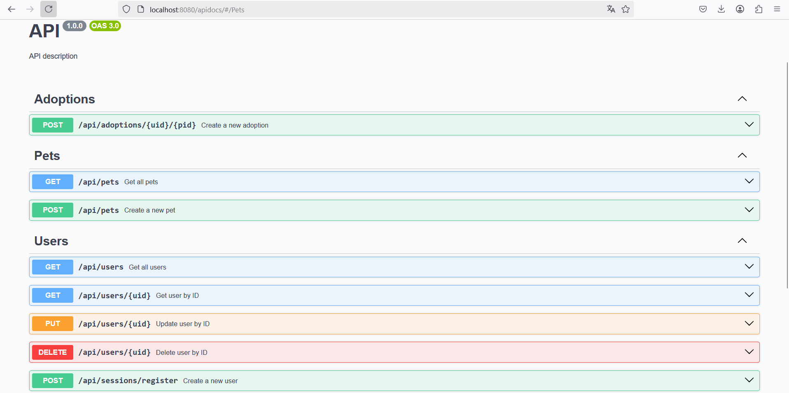

# Backend III
Se presenta el proyecto para la comisión de Backend III de CoderHouse

Donde partiendo de un template del proyecto de adopteme se añadió lo siguiente:
* Módulo mocking para crear mascotas y dueños mediante el uso de Faker js
* Manejo de middleware de errores para creación de nuevas mascotas y dueños
* Endpoint GET /api/mocks/mockingpets que genera un número determinado de mascotas
* Endpoint GET /api/mocks/mockingusers que genera un número determinado de usuarios
* Endpoint POST /api/mocks/generateData que genera un número determinado de mascotas y usuarios para luego guardarlos en la base de datos de MONGO DB

Se presenta el endpoint GET /api/mocks/mockingpets
.png)

Se presenta el endpoint GET /api/mocks/mockingusers
.png)

Se presenta el endpoint POST /api/mocks/generateData
.png)

Y lo comprobamos mediante MONGO COMPASS para ver que los registros se guardaron de manera correcta en la base de datos de Mongo :

Users collection          |  Pets collection
:-------------------------:|:-------------------------:
.png)  |  .png)

## Documentación con Swagger


## Ejecución en Docker
.png)

.png)

## Docker Hub

[Link](https://hub.docker.com/r/kevinbalderas/proyecto-final-b3-ch-kbs) de imagen de docker.


### Comando
```
docker pull kevinbalderas/proyecto-final-b3-ch-kbs
```
### Variables de entorno


[Link](https://drive.google.com/file/d/1pnJFQQrOKm6iw8BlaKUMvqo7QM8ueBnf/view?usp=sharing) de GoogleDrive para variables de entorno